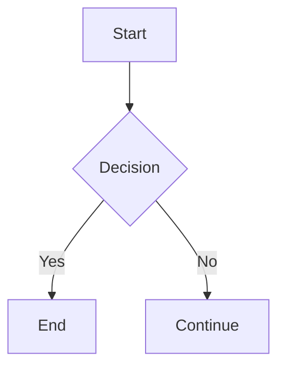

# Markdown Weaver

A powerful, real-time Markdown editor with live preview and advanced features. Write faster, preview smarter, and create beautifully formatted documents with ease.

**🌐 [Live Demo](https://markdown-weaver.netlify.app/)**

---

## 📋 Table of Contents

- [Features](#features)
- [Tech Stack](#tech-stack)
- [Installation](#installation)
- [Usage](#usage)
- [Project Structure](#project-structure)
- [Key Features Explained](#key-features-explained)
- [Keyboard Shortcuts](#keyboard-shortcuts)
- [Browser Support](#browser-support)
- [Contributing](#contributing)
- [License](#license)
- [Author](#author)

---

## ✨ Features

### Core Features
- **Real-time Preview** - Live preview as you type with instant rendering
- **GitHub-Flavored Markdown (GFM)** - Tables, task lists, strikethrough, and more
- **Easy Export** - Download as Markdown, HTML, or PDF
- **Local Storage** - Auto-save with browser local storage
- **Syntax Highlighting** - Beautiful code highlighting with multiple themes
- **Dark & Light Mode** - Seamless theme switching for any preference
- **Customizable Settings** - Fine-tune font size, line height, and more
- **Fully Responsive** - Works perfectly on desktop, tablet, and mobile
- **Lightning Fast** - Optimized for performance and speed

### Advanced Capabilities
- **HTML Support** - Embed HTML directly in your markdown
- **Git Integration** - Perfect for version control workflows with GitHub markdown compatibility
- **Document Structure** - Auto-generated table of contents and header navigation
- **Comprehensive Help** - Built-in documentation and keyboard shortcuts guide
- **Task Management** - Create and manage task lists with checkboxes
- **LaTeX Math Support** - Write mathematical equations using KaTeX
- **Mermaid Diagrams** - Create flowcharts, sequence diagrams, and more
- **Multiple View Modes** - Editor-only, preview-only, or split-view modes
- **Line Numbers** - Optional line numbering for better code readability
- **Word & Character Count** - Real-time statistics of your document
- **Undo/Redo** - Full undo/redo history
- **Sync Scroll** - Synchronized scrolling between editor and preview
- **Search & Replace** - Find and replace functionality

---

## 🛠 Tech Stack

**Frontend Framework:**
- React 18.3
- TypeScript 5.8
- Vite 5.4

**UI & Styling:**
- Tailwind CSS 3.4
- Shadcn/ui Components
- Radix UI (Accessible components)
- Lucide React (Icons)

**Markdown Processing:**
- react-markdown
- remark (GFM support)
- rehype (HTML transformations)
- highlight.js (Syntax highlighting)
- remark-math & rehype-katex (LaTeX math)
- Mermaid (Diagram rendering)

**Additional Libraries:**
- React Router DOM (Navigation)
- TanStack React Query (Data fetching)
- React Hook Form (Form handling)
- Zod (Schema validation)
- file-saver (Export functionality)
- next-themes (Theme management)
- sonner (Toast notifications)

**Build & Development:**
- ESLint (Code linting)
- PostCSS (CSS processing)
- Autoprefixer (CSS vendor prefixes)

---

## 📦 Installation

### Prerequisites
- Node.js (v18 or higher)
- npm or yarn or bun

### Setup

1. **Clone the repository**
   ```bash
   git clone https://github.com/Vasu657/markdown-weaver.git
   cd markdown-weaver
   ```

2. **Install dependencies**
   ```bash
   npm install
   # or
   yarn install
   # or
   bun install
   ```

3. **Start the development server**
   ```bash
   npm run dev
   # or
   yarn dev
   # or
   bun dev
   ```

4. **Open your browser**
   Navigate to `http://localhost:5173` (or the port shown in your terminal)

### Build for Production

```bash
npm run build
# or
yarn build
# or
bun build
```

The optimized build will be created in the `dist/` directory.

### Preview Production Build

```bash
npm run preview
# or
yarn preview
# or
bun preview
```

---

## 🎯 Usage

### Getting Started

1. **Open the editor** - Start writing in the left panel
2. **See live preview** - Your formatted output appears on the right
3. **Switch view modes** - Use toolbar buttons to switch between editor, preview, or split view
4. **Auto-save** - Your content is automatically saved to browser storage
5. **Export** - Click the export button to download as Markdown, HTML, or PDF

### Features in Action

#### Writing Markdown
```markdown
# Heading 1
## Heading 2

**Bold text** and *italic text*

- Bullet point
- Another point

1. Numbered list
2. Second item

[Link text](https://example.com)


| Column 1 | Column 2 |
|----------|----------|
| Cell 1   | Cell 2   |
```

#### Code Blocks
Wrap code in triple backticks with language specification:
```python
def hello_world():
    print("Hello, World!")
```

#### Math Equations
Use LaTeX syntax between `$...$` for inline or `$$...$$` for display math:
$$E = mc^2$$

#### Task Lists
```markdown
- [x] Completed task
- [ ] Pending task
```

#### Mermaid Diagrams


---

## 📁 Project Structure

```
markdown-weaver/
├── public/
│   ├── favicon.svg          # Application favicon
│   ├── placeholder.svg
│   └── robots.txt
├── src/
│   ├── components/
│   │   ├── ui/              # Shadcn/ui components
│   │   ├── Editor.tsx       # Main editor component
│   │   ├── MarkdownEditor.tsx # Markdown editor wrapper
│   │   ├── Preview.tsx      # Preview panel
│   │   ├── Toolbar.tsx      # Toolbar with actions
│   │   ├── StatusBar.tsx    # Status information
│   │   └── SaveIndicator.tsx # Save status indicator
│   ├── hooks/
│   │   ├── useMarkdownEditor.ts # Editor logic
│   │   ├── useAutoSave.ts       # Auto-save functionality
│   │   ├── useUndoRedo.ts       # Undo/redo management
│   │   ├── useTheme.ts          # Theme management
│   │   ├── useNotifications.ts  # Notifications
│   │   └── use-mobile.ts        # Mobile detection
│   ├── pages/
│   │   ├── Index.tsx        # Main editor page
│   │   ├── About.tsx        # About page with features
│   │   ├── Help.tsx         # Help and syntax guide
│   │   ├── Privacy.tsx      # Privacy policy
│   │   ├── Notifications.tsx # Notifications page
│   │   └── NotFound.tsx     # 404 page
│   ├── lib/
│   │   └── utils.ts         # Utility functions
│   ├── App.tsx              # Main app component
│   ├── App.css              # App styles
│   ├── index.css            # Global styles
│   ├── main.tsx             # App entry point
│   └── vite-env.d.ts        # Vite env types
├── .gitignore
├── components.json          # Shadcn/ui config
├── eslint.config.js         # ESLint configuration
├── index.html               # HTML template
├── package.json             # Dependencies and scripts
├── postcss.config.js        # PostCSS configuration
├── tailwind.config.ts       # Tailwind CSS config
├── tsconfig.json            # TypeScript configuration
├── vite.config.ts           # Vite configuration
└── README.md                # This file
```

---

## 🎨 Key Features Explained

### Real-time Preview
The editor uses React Markdown to parse and render your markdown in real-time. The preview updates instantly as you type, with support for GFM, LaTeX, and Mermaid diagrams.

### Local Storage Auto-save
Your content is automatically saved to the browser's local storage every few seconds. If you close the browser, your work is preserved.

### Multiple View Modes
- **Editor Mode** - Focus on writing with full editor panel
- **Preview Mode** - See the rendered output only
- **Split Mode** - See editor and preview side by side

### Export Functionality
Export your markdown document in multiple formats:
- **Markdown** - Pure markdown format
- **HTML** - Standalone HTML file
- **PDF** - Professional PDF document

### Theme Support
Toggle between dark and light modes. The app respects your system preference and allows manual switching.

### Responsive Design
The editor adapts to different screen sizes:
- Desktop: Split-view with side-by-side editor and preview
- Tablet: Responsive grid layout
- Mobile: Single-column layout with view mode switching

---

## ⌨️ Keyboard Shortcuts

| Action | Shortcut |
|--------|----------|
| Bold | `Ctrl/Cmd + B` |
| Italic | `Ctrl/Cmd + I` |
| Code | `Ctrl/Cmd + K` |
| Link | `Ctrl/Cmd + L` |
| Undo | `Ctrl/Cmd + Z` |
| Redo | `Ctrl/Cmd + Y` or `Ctrl/Cmd + Shift + Z` |
| Save | `Ctrl/Cmd + S` |

---

## 🌐 Browser Support

| Browser | Support |
|---------|---------|
| Chrome | ✅ Latest versions |
| Firefox | ✅ Latest versions |
| Safari | ✅ Latest versions |
| Edge | ✅ Latest versions |
| Opera | ✅ Latest versions |

---

## 🤝 Contributing

Contributions are welcome! To contribute:

1. Fork the repository
2. Create a feature branch (`git checkout -b feature/amazing-feature`)
3. Commit your changes (`git commit -m 'Add amazing feature'`)
4. Push to the branch (`git push origin feature/amazing-feature`)
5. Open a Pull Request

Please ensure your code follows the existing code style and passes linting:

```bash
npm run lint
```

---

## 📝 License

This project is open source and available under the MIT License.

---

## 👨‍💻 Author

**Vasu Ghanta** - Full-stack Developer

- **GitHub:** [@Vasu657](https://github.com/Vasu657)
- **Portfolio:** [vasughanta.netlify.app](http://vasughanta.netlify.app/)

---

## 🙏 Acknowledgments

- Built with [React](https://react.dev/)
- Styled with [Tailwind CSS](https://tailwindcss.com/)
- Components from [Shadcn/ui](https://ui.shadcn.com/)
- Markdown parsing with [react-markdown](https://github.com/remarkjs/react-markdown)
- Icons from [Lucide React](https://lucide.dev/)
- Math rendering with [KaTeX](https://katex.org/)
- Diagrams with [Mermaid](https://mermaid.js.org/)
- Deployed on [Netlify](https://www.netlify.com/)

---

## 📧 Support

If you encounter any issues or have questions, please:

1. Check the [Help & Syntax Guide](https://markdown-weaver.netlify.app/help)
2. Review the [Privacy Policy](https://markdown-weaver.netlify.app/privacy)
3. Open an issue on [GitHub](https://github.com/Vasu657/markdown-weaver/issues)

---

**Happy Writing! 🚀**
